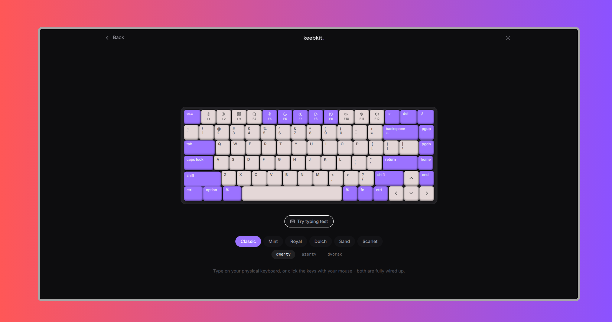

<p align="center">
  <a href="https://keebkit.vercel.app/">
    
  </a>
</p>


# keebkit

A keyboard component for React, with haptics, mechanical sound effects, six colorways, and three layouts (QWERTY / AZERTY / Dvorak). Ships as a real shadcn registry item so it can be installed straight into any project.

**Live site:** https://keebkit.vercel.app

## Install

```bash
pnpm dlx shadcn@latest add https://keebkit.vercel.app/r/keyboard.json
```

Then grab the click sound and drop it in `public/sounds/`:

```bash
mkdir -p public/sounds
curl -L https://keebkit.vercel.app/sounds/click.ogg -o public/sounds/click.ogg
```

## Usage

```jsx
import Keyboard from "@/components/ui/keyboard";

export default function Page() {
  return (
    <div className="flex min-h-96 w-full items-center justify-center">
      <Keyboard theme="classic" enableHaptics enableSound />
    </div>
  );
}
```

## Props

| Prop | Type | Default | Description |
|---|---|---|---|
| `theme` | `"classic" \| "mint" \| "royal" \| "dolch" \| "sand" \| "scarlet"` | `"classic"` | Colorway |
| `layout` | `"qwerty" \| "azerty" \| "dvorak"` | `"qwerty"` | Key mapping |
| `enableHaptics` | `boolean` | `true` | Vibrate on keydown (supported devices) |
| `enableSound` | `boolean` | `true` | Play mechanical click on keydown |
| `soundUrl` | `string` | `"/sounds/click.ogg"` | Path to the click sound |
| `onKeyEvent` | `(event) => void` | `undefined` | Fires on every key down/up |
| `className` | `string` | `undefined` | Extra classes on the frame |

## Local dev

```bash
npm install
npm run dev
```

## Deploy

Deployed on Vercel. Push to your repo and import it in the Vercel dashboard - no config needed, it's a standard Vite app.


If you enjoyed this project, consider giving it a ⭐ on GitHub. It helps others discover the project and motivates future improvements.


# License (MIT)

This project is licensed under the MIT License.

```text
MIT License

Copyright (c) 2026 Bilal Malik

Permission is hereby granted, free of charge, to any person obtaining a copy
of this software and associated documentation files (the "Software"), to deal
in the Software without restriction, including without limitation the rights
to use, copy, modify, merge, publish, distribute, sublicense, and/or sell
copies of the Software, and to permit persons to whom the Software is
furnished to do so, subject to the following conditions:

The above copyright notice and this permission notice shall be included in all
copies or substantial portions of the Software.

THE SOFTWARE IS PROVIDED "AS IS", WITHOUT WARRANTY OF ANY KIND, EXPRESS OR
IMPLIED, INCLUDING BUT NOT LIMITED TO THE WARRANTIES OF MERCHANTABILITY,
FITNESS FOR A PARTICULAR PURPOSE AND NONINFRINGEMENT. IN NO EVENT SHALL THE
AUTHORS OR COPYRIGHT HOLDERS BE LIABLE FOR ANY CLAIM, DAMAGES OR OTHER
LIABILITY, WHETHER IN AN ACTION OF CONTRACT, TORT OR OTHERWISE, ARISING FROM,
OUT OF OR IN CONNECTION WITH THE SOFTWARE OR THE USE OR OTHER DEALINGS IN THE
SOFTWARE.
```
Made by [@byllzz](https://github.com/byllzz)

<p align="right">
  <a href="#keebkit">⬆ Back to Top</a>
</p>
